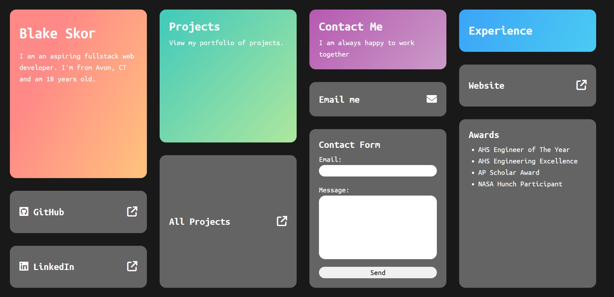

# Blake Skor's Portfolio

A portfolio to contact me and see my work.

## Description

This repository serves holds the website for my personal portfolio. It was built entirely from HTML and CSS. It was also an educational experience as one of my first web apps, implementing new skills. It is fully responsive and engaging.

## Getting Started

### Using the Website

- Please turn off your computer's zoom in settings on your monitor for optimal scaling

Accessible at: <https://bskor66.github.io/portfolio/index.html>

## Authors

Blake Skor

## Version History

- 1
  - Initial Release

## License

This project is licensed under the MIT License - see the LICENSE file for details

## Acknowledgments

Inspiration, code snippets, etc.

- [CSS Gradient](https://cssgradient.io/)
- [READEME Template](https://gist.github.com/DomPizzie/7a5ff55ffa9081f2de27c315f5018afc)
- [Normalize CSS](https://github.com/necolas/normalize.css)
- [Ubuntu Mono Font](https://fonts.google.com/specimen/Ubuntu+Mono)
- [FontAwesome Icons](https://fontawesome.com/)
- [Layout Inspiration from Apple Keynote](https://www.digitaltrends.com/wp-content/uploads/2023/09/iphone-15-pro-recap-presentation-screen.jpeg?fit=2548%2C1431&p=1)
